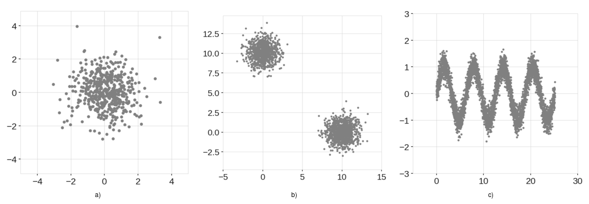
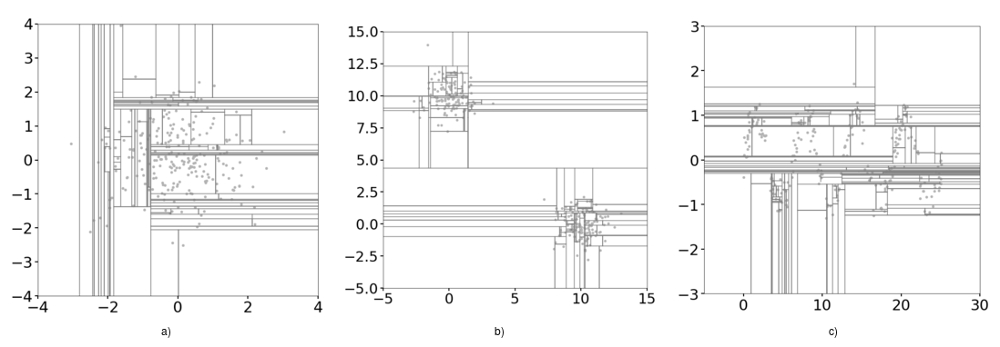
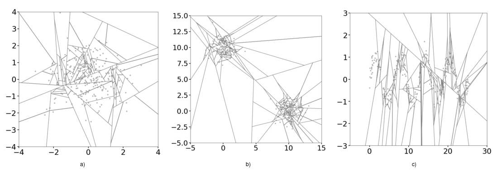
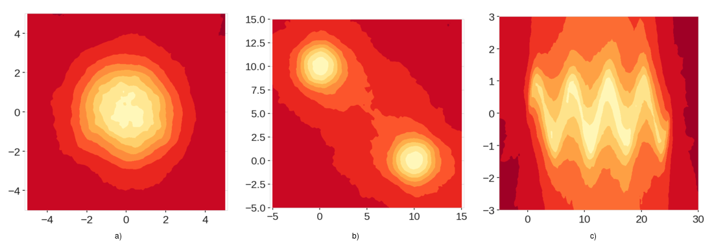
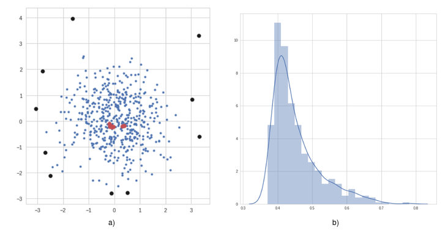

<a href="https://github.com/sahandha/eif/releases/tag/v1.0.2"> </a><a href="https://pypi.org/project/eif/1.0.2/"></a><a href="https://doi.org/10.1109/TKDE.2019.2947676"></a>

## Table of contents
- [Extended Isolation Forest](#Extended-Isolation-Forest)
    - [Summary](#Summary)
    - [Motivation](#Motivation)
    - [Isolation Forest](#Isolation-Forest)
    - [Extension](#Extension)
    - [The Code](#The-Code)
- [Installation](#Installation)
    - [Requirements](#Requirements)
- [Use](#Use)
- [Citation](#Citation)
- [Releases](#Releases)


## Extended Isolation Forest

This is a simple package implementation for the Extended Isolation Forest method described in this [paper](https://doi.org/10.1109/TKDE.2019.2947676). It is an improvement on the original algorithm Isolation Forest which is described (among other places) in this [paper](https://cs.nju.edu.cn/zhouzh/zhouzh.files/publication/icdm08b.pdf) for detecting anomalies and outliers for multidimensional data point distributions.

### Summary

The problem of anomaly detection has wide range of applications in various fields and scientific applications. Anomalous data can have as much scientific value as normal data or in some cases even more, and it is of vital importance to have robust, fast and reliable algorithms to detect and flag such anomalies. Here, we present an extension to the model-free anomaly detection algorithm, Isolation Forest [Liu2008](https://cs.nju.edu.cn/zhouzh/zhouzh.files/publication/icdm08b.pdf). This extension, named Extended Isolation Forest (EIF), improves the consistency and reliability of the anomaly score produced by standard methods for a given data point. We show that the standard Isolation Forest produces inconsistent anomaly score maps, and that these score maps suffer from an artifact produced as a result of how the criteria for branching operation of the binary tree is selected.

Our method allows for the slicing of the data to be done using hyperplanes with random slopes which results in improved score maps. The consistency and reliability of the algorithm is much improved using this extension. Here we show the need for an improvement on the source algorithm to improve the scoring of anomalies and the robustness of the score maps especially around edges of nominal data. We discuss the sources of the problem, and we present an efficient way for choosing these hyperplanes which give way to multiple extension levels in the case of higher dimensional data. The standard Isolation Forest is therefore a special case of the Extended Isolation Forest as presented it here. For an *N* dimensional dataset, Extended Isolation Forest has *N* levels of extension, with *0* being identical to the case of standard Isolation Forest, and *N-1* being the fully extended version.


### Motivation



**Figure 1**: Example training data. a) Normally distributed cluster. b) Two normally distributed clusters. c) Sinusoidal data points with Gaussian noise.

While various techniques exist for approaching anomaly detection, Isolation Forest [Liu2008](https://cs.nju.edu.cn/zhouzh/zhouzh.files/publication/icdm08b.pdf) is one with unique capabilities. This algorithm can readily work on high dimensional data, it is model free, and it scales well. It is therefore highly desirable and easy to use. However, looking at score maps for some basic example, we can see that the anomaly scores produced by the standard Isolation Forest are inconsistent, . To see this we look at the three examples shown in Figure 1.


In each case, we use the data to train our Isolation Forest. We then use the trained models to score a square grid of uniformly distributed data points, which results in score maps shown in Figure 2. Through the simplicity of the example data, we have an intuition about what the score maps should look like. For example, for the data shown in Figure 1a, we expect to see low anomaly scores in the center of the map, while the anomaly score should increase as we move radially away from the center. Similarly for the other figures.

Looking at the score maps produced by the standard Isolation Forest shown in Figure 2, we can clearly see the inconsistencies in the scores. While we can clearly see a region of low anomaly score in the center in Figure 2a, we can also see regions aligned with x and y axes passing through the origin that have lower anomaly scores compared to the four corners of the region. Based on our intuitive understanding of the data, this cannot be correct. A similar phenomenon is observed in Figure 2b. In this case, the problem is amplified. Since there are two clusters, the artificially low anomaly score regions intersect close to points (0,0) and (10,10), and create low anomaly score regions where there is no data. It is immediately obvious how this can be problematic. As for the third example, figure 2c shows that the structure of the data is completely lost. The sinusoidal shape is essentially treated as one rectangular blob.


**Figure 2**: Score maps using the Standard Isolation Forest for the points from Figure 1. We can see the bands and artifacts on these maps


### Isolation Forest

 Given a dataset of dimension *N*, the algorithm chooses a random sub-sample of data to construct a binary tree. The branching process of the tree occurs by selecting a random dimension *x_i* with *i* in *{1,2,...,N}* of the data (a single variable). It then selects a random value *v* within the minimum and maximum values in that dimension. If a given data point possesses a value smaller than *v* for dimension *x_i*, then that point is sent to the left branch, otherwise it is sent to the right branch. In this manner the data on the current node of the tree is split in two. This process of branching is performed recursively over the dataset until a single point is isolated, or a predetermined depth limit is reached. The process begins again with a new random sub-sample to build another randomized tree. After building a large ensemble of trees, i.e. a forest, the training is complete.


 During the scoring step, a new candidate data point (or one chosen from the data used to create the trees) is run through all the trees, and an ensemble anomaly score is assigned based on the depth the point reaches in each tree. Figure 3 shows an schematic example of a tree and a forest plotted radially.  


**Figure 3**: a) Shows an example tree formed from the example data while b) shows the forest generated where each tree is represented by a radial line from the center to  the  outer  circle.  Anomalous  points  (shown  in  red)  are  isolated  very  quickly,which means they reach shallower depths than nominal points (shown in blue).

It turns out the splitting process described above is the main source of the bias observed in the score maps. Figure 4 shows the process described above for each one of the examples considered thus far. The branch cuts are always parallel to the axes, and as a result over construction of many trees, regions in the domain that don't occupy any data points receive superfluous branch cuts.




**Figure 4**: Splitting of data in the domain during the process of construction of one tree.


### Extension

The Extended Isolation Forest remedies this problem by allowing the branching process to occur in every direction. The process of choosing branch cuts is altered so that at each node, instead of choosing a random feature along with a random value, we choose a random normal vector along with a random intercept point.

Figure 5 shows the resulting branch cuts int he domain for each of our examples.



**Figure 5**: Same as Figure 4 but using Extended Isolation Forest

We can see that the region is divided much more uniformly, and without the bias introducing effects of the coordinate system. As in the case of the standard Isolation Forest, the anomaly score is computed by the aggregated depth that a given point reaches on each `iTree`.


As we see in Figure 6, these modifications completely fix the issue with the score maps that we saw before and produce reliable results. Clearly, these score maps are a much better representation of anomaly score distributions.



**Figure 6**: Score maps using the Extended Isolation Forest.

Figure 7 shows a very simple example of anomalies and nominal points from a Single blob example as shown in Figure 1a. It also shows the distribution of the anomaly scores which can be used to make hard cuts on the definition of anomalies or even assign probabilities to each point.



**Figure 7**: a) Shows the dataset used, some sample anomalous data points discovered using the algorithm are highlighted in black. We also highlight some nominal points in red. In b), we have the distribution of anomaly scores obtained by the algorithm.


### The Code

Here we provide the source code for the algorithm as well as documented example notebooks to help get started. Various visualizations are provided such as score distributions, score maps, aggregate slicing of the domain, and tree and whole forest visualizations. Most examples are in 2D. We present one 3D example. However, the algorithm works readily with higher dimensional data.

## Installation


    pip install eif


or directly from the repository


    pip install git+https://github.com/sahandha/eif.git


### Requirements

- numpy
- cython

No extra requirements are needed.
In addition, it also contains means to draw the trees created using the [igraph](http://igraph.org/) library. See the example for tree visualizations.

## Use

See these notebooks for examples on how to use it

- [Basics](Notebooks/EIF.ipynb)
- [3D Example](Notebooks/general_3D_examples.ipynb)
- [Tree visualizations](Notebooks/TreeVisualization.ipynb)

## Citation

If you use this code and method, please considering using the following reference:

A link to the paper can be found [here](https://doi.org/10.1109/TKDE.2019.2947676)

```
@ARTICLE{8888179,
author={S. {Hariri} and M. {Carrasco Kind} and R. J. {Brunner}},
journal={IEEE Transactions on Knowledge and Data Engineering},
title={Extended Isolation Forest},
year={2019},
volume={},
number={},
pages={1-1},
keywords={Forestry;Vegetation;Distributed databases;Anomaly detection;Standards;Clustering algorithms;Heating systems;Anomaly Detection;Isolation Forest},
doi={10.1109/TKDE.2019.2947676},
ISSN={},
month={},}
```

## Releases

### v2.0.0
#### 2019-NOV-14
- Convert code into C++ with using cython. Much faster and efficient forest generation and scoring procedures

### v1.0.2
#### 2018-OCT-01
- [Release](https://github.com/sahandha/eif/releases/tag/v1.0.2)
- Added documentation, examples and software paper

### v1.0.1
#### 2018-AUG-08
- Bugfix for multidimensional data

### v1.0.0
#### 2018-JUL-15
- Initial Release
