# Summary

The problem of anomaly detection has wide range of applications in various fields including scientific applications. anomalous data can have as much scientific value as normal data or in some cases even more. In this paper, we present an extension to the model-free anomaly detection algorithm, Isolation Forest. This extension, named Extended Isolation Forest (EIF), improves the consistency and reliability of the anomaly score produced by standard methods for a given data point. We show that the standard Isolation Forest produces inconsistent scores using score maps, and that these score maps suffer from an artifact produced as a result of how the criteria for branching operation of the binary tree is selected. Our proposed method allows for the slicing of the data to be done using hyperplanes with random slopes. This approach results in improved score maps. The consistency and reliability of the algorithm is much improved using this extension. We find no appreciable difference in the rate of convergence nor in computational time between the standard Isolation Forest and EIF which highlights its potential as anomaly detection algorithm.

# Motivation
While various techniques exist for approaching anomaly detection, Isolation Forest [@Liu2008] is one with unique capabilities. This algorithm can readily work on high dimensional data, it is model free, and it is computationally scalable. It is therefore highly desirable and easy to use. However, Looking at score maps for some basic example, we can see that the anomaly scores produced by the standard Isolation Forest are inconsistent. Too see this we look at the three examples shown below.

  <figure align="center">
    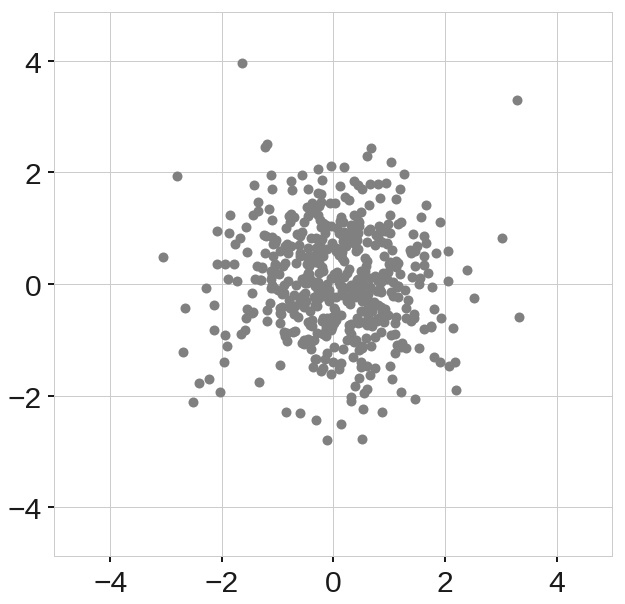
    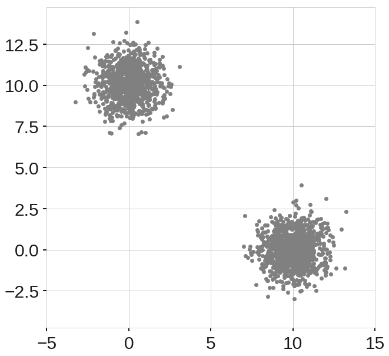
    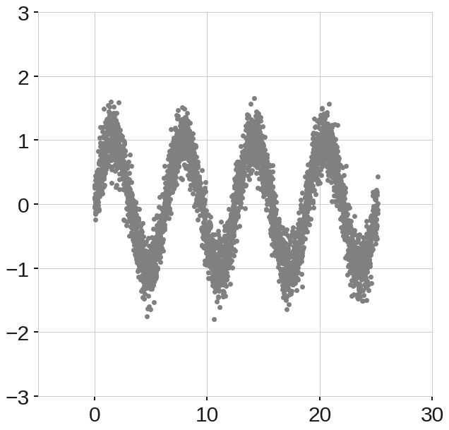
    <figcaption>Fig.1 Example training data. a) Normally distributed cluster. b) Two normally distributed clusters. c) Sinusoidal data points with
Gaussian noise. </figcaption>
  </figure>

In each case, we use the data to train our Isolation Forest. We then use the train models to score a square grid of uniformly distributed data points, which results in score maps shown in figure 2. Through the simplicity of the example data, we have an intuition about what the score maps should look like. For example, for the data shown in figure 1a, we expect to see low anomaly scores in the center of the map, while the score increases as we move radially away from the center. For the example of figure 1b, we can expect to see two low anomaly score circles where the clusters are, while the rest of the domain shows higher anomaly scores. In the last example, figure 1c, we expect to see low anomaly region shaped in the form of a sinusoid.  

  <figure align="center">
    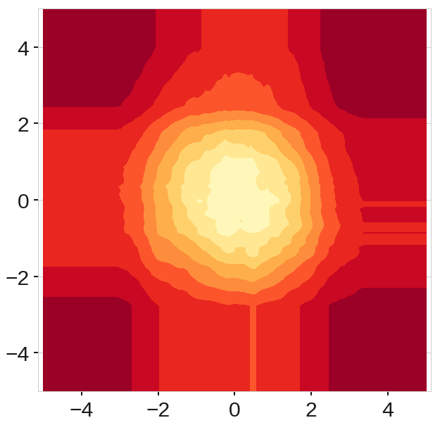
    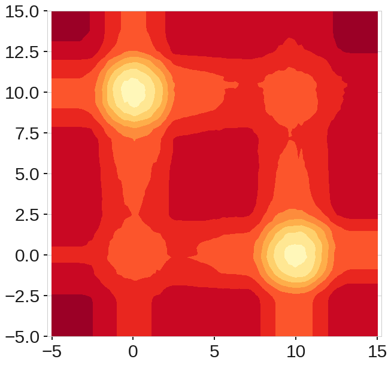
    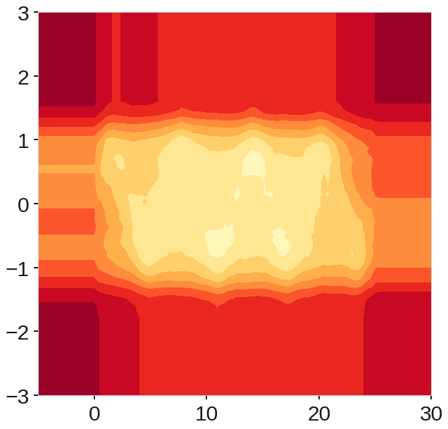
    <figcaption>Fig.2 Score maps using the Extended Isolation Forest. </figcaption>
  </figure>

Looking at the score maps produced by the standard Isolation Forest shown in figure 2, we can clearly see the inconsistencies in the scores. While we can clearly see a region of low anomaly score in the center in figure 2a, we can also see regions aligned with x and y axes passing through the origin that have lower anomaly scores compared to the four corners of the region. Based on our intuitive understanding of the data, this cannot be correct. A similar phenomenon is observed in figure 2b. In this case, the problem is amplified. Since there are two clusters, the artificially low anomaly score regions intersect close to points (0,0) and (10,10), and create low anomaly score regions where there is no data. It is immediately obvious how this can be problematic. As for the third example, figure 2c shows that the structure of the data is completely lost the sinusoidal shape is essentially treat as one rectangular blob. We will show that our extension of the algorithm fixes these issues with the anomaly score produced by standard Isolation Forest. We present a brief description of how Isolation Forest works in order to explain our extension.

 # Isolation forest
In the algorithm, data is sub-sampled, and processed in a tree structure based on random cuts in the values of randomly selected features in the data set. Those samples that travel deeper into the tree branches are less likely to be anomalous, while shorter branches are indicative of anomaly. As such, the aggregated lengths of the tree branches provide for a measure of anomaly or an “anomaly score” for every given point.

  <figure align="center">
    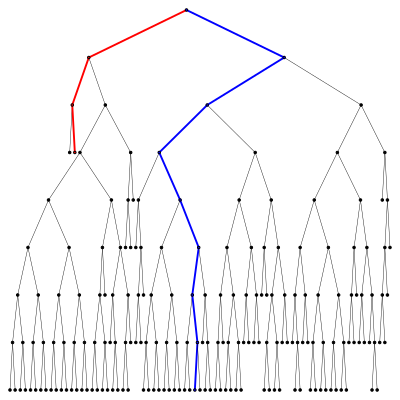
    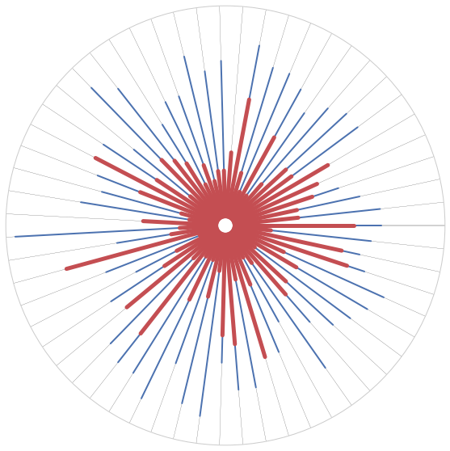
    <figcaption>Fig.4 a) Shows an example tree formed from the example data while b) shows the forest generated where each tree is represented by a radial line from the center to  the  outer  circle.  Anomalous  points  (shown  in  red)  are  isolated  very  quickly,which means they reach shallower depths than nominal points (shown in blue). </figcaption>
  </figure>

  <figure align="center">
    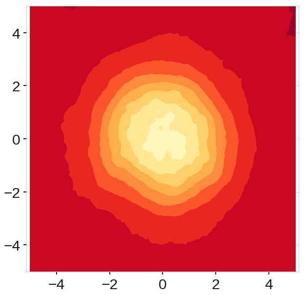
    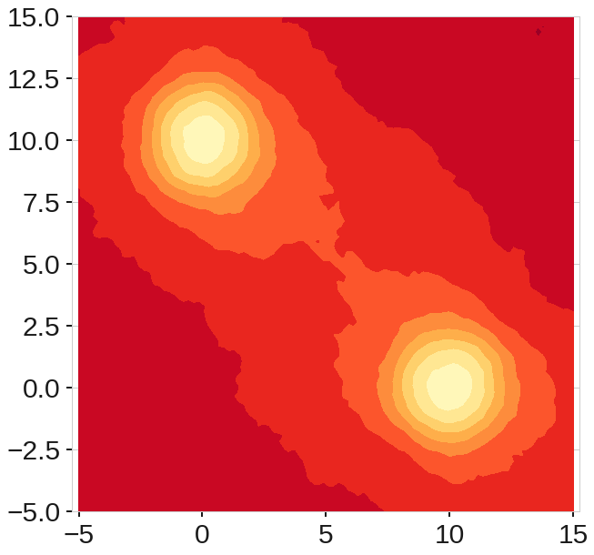
    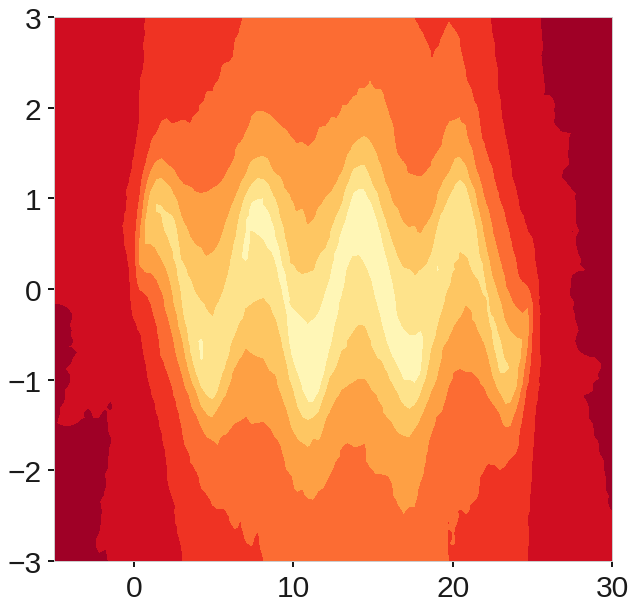
    <figcaption>Fig.3 Score maps using the Extended Isolation Forest. </figcaption>
  </figure>

# The `eif` algorithm

| **Algorithm 1** $iForest(X, t, \psi)$ |
| ---------------------------------- |
| **Require:** $X$ - input data, $t$ - number of trees, $h$ - sub-sampling size |
| **Ensure:** a set of $t$ $iTrees$ |
|   $\quad$ 1. **Initialize** $Forest$ |
|   $\quad$ 2. set height limit $l = ceiling(\log_2 \psi)$ |
|   $\quad$ 3. **for** $i = 1$ to $t$ **do** |
|   $\quad$ 4. $X' \gets sample(X, \psi)$ |
|   $\quad$ 5. $Forest \gets Forest \cup iTree(X', 0, l)$ |
|   $\quad$ 6. **end for** |

| **Algorithm 2** $iTree(X, e, l)$ |
| -------------------------------- |
| **Require:** $X$ - input data, $e$ - current tree height, $l$ - height limit |
| **Ensure:** an $iTree$ |
| $\quad$ 1. **if** $e \geq l$ or $|X| \leq 1$ **then** |
| $\quad$ 2. $\quad$ **return** $exNode\{Size \gets |X|\}$ |
| $\quad$ 3. **else** |
| $\quad$ 4. get a random normal vector $\vec{n} \in {\rm I\!R}^{|X|}$ where each coordinate is $\sim \mathcal{N}(0,\,1)$|
| $\quad$ 5. randomly select an intercept point $\vec{p} \in  {\rm I\!R}^{|X|}$ in the range of $X$ |
| $\quad$ 6. set coordinates of $\vec{n}$ to zero according to extension level |
| $\quad$ 7. $X_l \gets filter(X,(X-\vec{p})\cdot \vec{n} \leq 0)$ |
| $\quad$ 8. $X_r \gets filter(X,(X-\vec{p})\cdot \vec{n} > 0)$  |
| $\quad$ 9. **return** $inNode\{$ |
| $\quad$$\quad$$\quad$  $Left \gets iTree(X_l,e+1, l),$ |
| $\quad$$\quad$$\quad$  $Right \gets iTree(X_r,e+1,l),$ |
| $\quad$$\quad$$\quad$  $Normal \gets \vec{n},$ |
| $\quad$$\quad$$\quad$  $Intercept \gets \vec{p} \}$  |
| $\quad$ 10. **end if** |

| **Algorithm 3**  $PathLength(x,T,e)$|
| -------------------------------- |
| **Require:** $\vec{x}$ - an instance, $T$ - an iTree, $e$ - current path length; initialized to 0|
| **Ensure:**  path length of $\vec{x}$ |
| $\quad$ 1. **if** $T$ is an external node **then** |
| $\quad$ 2. $\quad$ **return** $e + c(T.size)\{c(.) \text{ is defined in Equation 1}\}$ |
| $\quad$ 3. **end if** |
| $\quad$ 4. $\vec{n} \gets T.Normal$ |
| $\quad$ 5. $\vec{p} \gets T.Intercept$ |
| $\quad$ 6. **if** {$(\vec{x}-\vec{p})\cdot \vec{n} \leq 0$} **then** |
| $\quad$ 7. $\quad$ return $PathLength(\vec{x},T.left, e+1)$ |
| $\quad$ 8. **else if**  {$(\vec{x}-\vec{p})\cdot \vec{n} > 0$} **then** |
| $\quad$ 9. **return** $PathLength(\vec{x},T.rigth, e+1)$ |
| $\quad$ 10. **end if** |

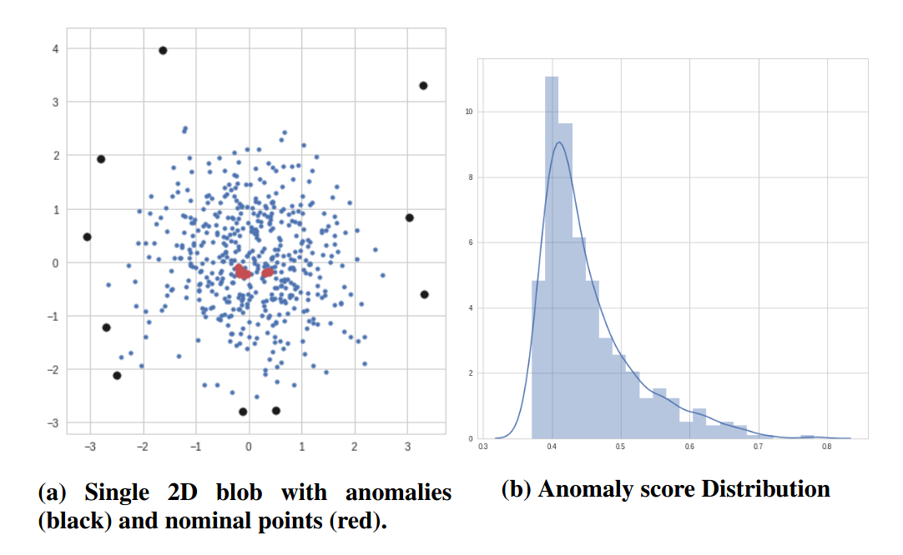

# Acknowledgements
MCK is supported by the National Science Foundation under Grant NSF AST 07-15036 and NSF AST 08-13543

# References
