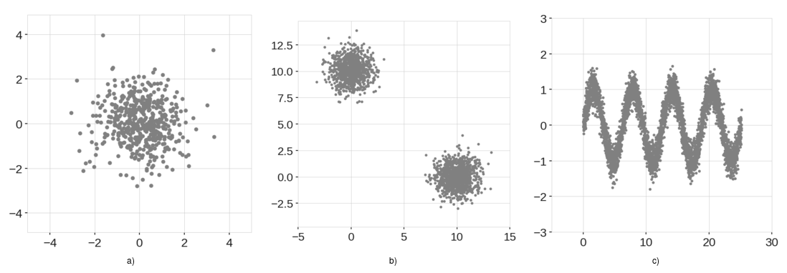
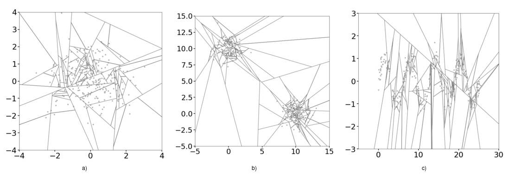
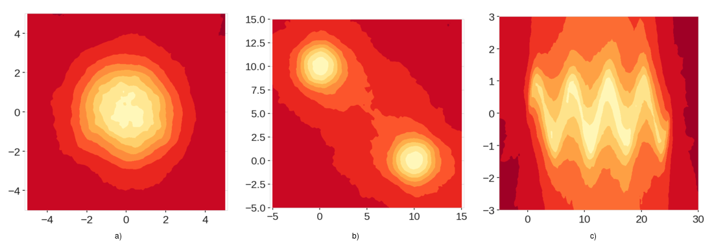
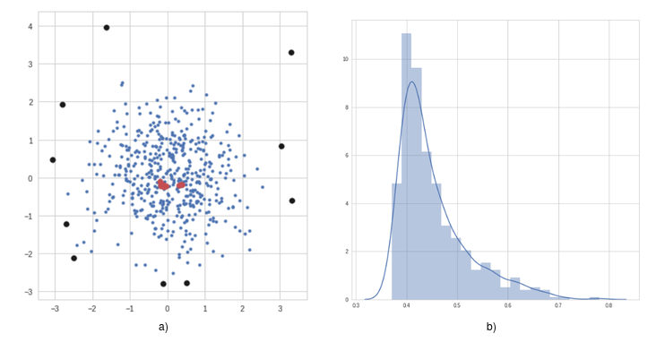

# Summary

The problem of anomaly detection has wide range of applications in various fields and scientific applications. Anomalous data can have as much scientific value as normal data or in some cases even more, and it is of vital importance to have robust, fast and reliable algorithms to detect and flag such anomalies. In this paper, we present an extension to the model-free anomaly detection algorithm, Isolation Forest [@Liu2008; @Liu2012]. This extension, named Extended Isolation Forest (EIF), improves the consistency and reliability of the anomaly score produced by standard methods for a given data point. We show that the standard Isolation Forest produces inconsistent anomaly score maps, and that these score maps suffer from an artifact produced as a result of how the criteria for branching operation of the binary tree is selected.

Our method allows for the slicing of the data to be done using hyperplanes with random slopes which results in improved score maps. The consistency and reliability of the algorithm is much improved using this extension. This is briefly mentioned in [@liu2010detecting] although in the context of optimization for detection of anomaly clusters. Here we show the need for an improvement on the source algorithm to improve the scoring of anomalies and the robustness of the score maps especially around edges of nominal data. We discuss the sources of the problem, and we present an efficient way for choosing these hyperplanes which give way to multiple extension levels in the case of higher dimensional data. The standard Isolation Forest is therefore a special case of the Extended Isolation Forest as presented it here. We find no appreciable difference in the rate of convergence nor in computational time between the standard Isolation Forest and EIF which highlights its potential as anomaly detection algorithm.

This method has been written completely in [Python](https://www.python.org/) and the only requirement is NumPy [@NumPy] and can be easily installed using `pip install eif` or directly from the source code located at [https://github.com/sahandha/eif](https://github.com/sahandha/eif) where we have also added some example Jupyter[@Kluyver2016] Notebooks and documented code on how to get started.

# Motivation

While various techniques exist for approaching anomaly detection, Isolation Forest [@Liu2008] is one with unique capabilities. This algorithm can readily work on high dimensional data, it is model free, and it scales well. It is therefore highly desirable and easy to use. However, looking at score maps for some basic example, we can see that the anomaly scores produced by the standard Isolation Forest are inconsistent, . To see this we look at the three examples shown in Figure 1.

In each case, we use the data to train our Isolation Forest. We then use the trained models to score a square grid of uniformly distributed data points, which results in score maps shown in Figure 2. Through the simplicity of the example data, we have an intuition about what the score maps should look like. For example, for the data shown in Figure 1a, we expect to see low anomaly scores in the center of the map, while the anomaly score should increase as we move radially away from the center. Similarly for the other figures.

Looking at the score maps produced by the standard Isolation Forest shown in Figure 2, we can clearly see the inconsistencies in the scores. While we can clearly see a region of low anomaly score in the center in Figure 2a, we can also see regions aligned with x and y axes passing through the origin that have lower anomaly scores compared to the four corners of the region. Based on our intuitive understanding of the data, this cannot be correct. A similar phenomenon is observed in Figure 2b. In this case, the problem is amplified. Since there are two clusters, the artificially low anomaly score regions intersect close to points (0,0) and (10,10), and create low anomaly score regions where there is no data. It is immediately obvious how this can be problematic. As for the third example, figure 2c shows that the structure of the data is completely lost. The sinusoidal shape is essentially treated as one rectangular blob.

We present a brief description of how Isolation Forest works in order to explain our extension.

# Isolation Forest

 Given a dataset of dimension $N$, the algorithm chooses a random sub-sample of data to construct a binary tree. The branching process of the tree occurs by selecting a random dimension $x_i$ with $i$ in $\{1,2,...,N\}$ of the data (a single variable). It then selects a random value $v$ within the minimum and maximum values in that dimension. If a given data point possesses a value smaller than $v$ for dimension $x_i$, then that point is sent to the left branch, otherwise it is sent to the right branch. In this manner the data on the current node of the tree is split in two. This process of branching is performed recursively over the dataset until a single point is isolated, or a predetermined depth limit is reached. The process begins again with a new random sub-sample to build another randomized tree. After building a large ensemble of trees, i.e. a forest, the training is complete. The creation of the forest is summarized in Algorithm 1 and the Class `iForest()` in the code.

 | **Algorithm 1** $iForest(X, t, \psi)$ |
 | ---------------------------------- |
 | **Require:** $X$ - input data, $t$ - number of trees, $h$ - sub-sampling size |
 | **Ensure:** a set of $t$ $iTrees$ |
 |   $\quad$ 1. **Initialize** $Forest$ |
 |   $\quad$ 2. set height limit $l = ceiling(\log_2 \psi)$ |
 |   $\quad$ 3. **for** $i = 1$ to $t$ **do** |
 |   $\quad$ 4. $X' \gets sample(X, \psi)$ |
 |   $\quad$ 5. $Forest \gets Forest \cup iTree(X', 0, l)$ |
 |   $\quad$ 6. **end for** |

 During the scoring step, a new candidate data point (or one chosen from the data used to create the trees) is run through all the trees, and an ensemble anomaly score is assigned based on the depth the point reaches in each tree. Figure 3 shows an schematic example of a tree and a forest plotted radially.  

It turns out the splitting process described above is the main source of the bias observed in the score maps. Figure 4 shows the process described above for each one of the examples considered thus far. The branch cuts are always parallel to the axes, and as a result over construction of many trees, regions in the domain that don't occupy any data points receive superfluous branch cuts.

The branching process shouldn't be affected by the choice of our coordinate system.

# Extended Isolation Forest

The Extended Isolation Forest remedies this problem by allowing the branching process to occur in every direction. The process of choosing branch cuts is altered so that at each node, instead of choosing a random feature along with a random value, we choose a random normal vector along with a random intercept point. The criteria of splitting the node in the binary tree is determined by the equation:

\begin{align}
(\vec{x}-\vec{p}) \cdot \vec{n} \leq 0
\end{align}

where $n$ is the normal vector, $p$ is the random intercept. $x$ is a give data point. If the inequality is satisfied, point $x$ is passed down to the left branch of the tree. Otherwise, it is passed down to the right branch as explained in Algorithm 2. Each tree is a Python Class `iTree()` in the code.

\newpage

| **Algorithm 2** $iTree(X, e, l)$ |
| -------------------------------- |
| **Require:** $X$ - input data, $e$ - current tree height, $l$ - height limit |
| **Ensure:** an $iTree$ |
| $\quad$ 1. **if** $e \geq l$ or $|X| \leq 1$ **then** |
| $\quad$ 2. $\quad$ **return** $exNode\{Size \gets |X|\}$ |
| $\quad$ 3. **else** |
| $\quad$ 4. get a random normal vector $\vec{n} \in {\rm I\!R}^{|X|}$ where each coordinate is $\sim \mathcal{N}(0,\,1)$|
| $\quad$ 5. randomly select an intercept point $\vec{p} \in  {\rm I\!R}^{|X|}$ in the range of $X$ |
| $\quad$ 6. set coordinates of $\vec{n}$ to zero according to extension level |
| $\quad$ 7. $X_l \gets filter(X,(X-\vec{p})\cdot \vec{n} \leq 0)$ |
| $\quad$ 8. $X_r \gets filter(X,(X-\vec{p})\cdot \vec{n} > 0)$  |
| $\quad$ 9. **return** $inNode\{$ |
| $\quad$$\quad$$\quad$  $Left \gets iTree(X_l,e+1, l),$ |
| $\quad$$\quad$$\quad$  $Right \gets iTree(X_r,e+1,l),$ |
| $\quad$$\quad$$\quad$  $Normal \gets \vec{n},$ |
| $\quad$$\quad$$\quad$  $Intercept \gets \vec{p} \}$  |
| $\quad$ 10. **end if** |

Figure 5 shows the resulting branch cuts int he domain for each of our examples.

We can see that the region is divided much more uniformly, and without the bias introducing effects of the coordinate system. As in the case of the standard Isolation Forest, the anomaly score is computed by the aggregated depth that a given point reaches on each $iTree$. The depth computation is defined by the Class `PathFactor()` in the code and is given by Algorithm 3, with a normalizing factor defined as the average depth in an unsuccessful search in a Binary Search Tree (BST):
\begin{align}
c(n) = 2H(n-1) - (2(n-1)/n)
\end{align}

where $H(i)$ is the harmonic number and can be estimated by $\ln(i) + 0.5772156649$ (Euler's constant) [@Liu2012] and $n$ is the number of points used in he construction of the trees. The final anomaly score $s$ for a given point $x$ is given by :

\begin{align}
s(x,n) = 2^{-E(h(x))/c(n)}
\end{align}

where $E(h(x))$ is the average of the depths the point reached in all trees.

\newpage

| **Algorithm 3**  $PathLength(x,T,e)$|
| -------------------------------- |
| **Require:** $\vec{x}$ - an instance, $T$ - an iTree, $e$ - current path length; initialized to 0|
| **Ensure:**  path length of $\vec{x}$ |
| $\quad$ 1. **if** $T$ is an external node **then** |
| $\quad$ 2. $\quad$ **return** $e + c(T.size)\{c(.) \text{ is defined in Equation 2}\}$ |
| $\quad$ 3. **end if** |
| $\quad$ 4. $\vec{n} \gets T.Normal$ |
| $\quad$ 5. $\vec{p} \gets T.Intercept$ |
| $\quad$ 6. **if** {$(\vec{x}-\vec{p})\cdot \vec{n} \leq 0$} **then** |
| $\quad$ 7. $\quad$ return $PathLength(\vec{x},T.left, e+1)$ |
| $\quad$ 8. **else if**  {$(\vec{x}-\vec{p})\cdot \vec{n} > 0$} **then** |
| $\quad$ 9. **return** $PathLength(\vec{x},T.rigth, e+1)$ |
| $\quad$ 10. **end if** |

As we see in Figure 6, these modifications completely fix the issue with the score maps that we saw before and produce reliable results. Clearly, these score maps are a much better representation of anomaly score distributions.

Figure 7 shows a very simple example of anomalies and nominal points from a Single blob example as shown in Figure 1a. It also shows the distribution of the anomaly scores which can be used to make hard cuts on the definition of anomalies or even assign probabilities to each point.

# Conclusions

We present an robust, open source extension to the Isolation Forest algorithm which produces accurate anomaly score maps. We provide the motivation behind this code and the comparison between the standard and the extended methods. Given the scalability of this method, this algorithm can be extended to work on distributed computing systems as shown in [@Hariri2018] and can be readily used in scientific applications to find anomalies in the data.

# References
